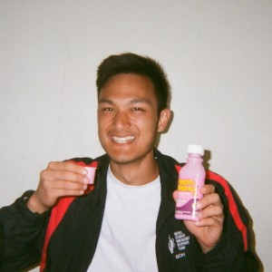

{: .center-image}

I'm a third-year undergraduate student at McGill University pursuing a BSc in Mathematics and Computer Science with a minor in Linguistics. I was born in Singapore but spent most of my childhood in Leduc, Alberta. I graduated from Beaumont Composite High School before serving in the Singapore Armed Forces from 2015 to 2017.

I received a traditional Java-based programming education from which I may never fully recover. When I write programs for fun I like to write in C, OCaml/Haskell/ML, PostScript, and Scheme. My academic interests include:

+ analysis of algorithms
+ analysis of random discrete structures
+ group theory
+ programming language theory
+ compilers

My favourite polygon is the pentagon.

As a certified First Responder, I volunteer with the [McGill Student Emergency Response Team](https://www.msert.ca).

When I'm not writing programs or attending school, I enjoy bouldering, travelling, photography, and playing video games.

My CV is available in both
[TeX](https://raw.githubusercontent.com/marcelgoh/marcelgoh.github.io/master/about/vita.tex)
and [PDF]({{ site.baseurl}}/about/vita.pdf) formats.
