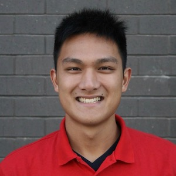

{: .center-image}

(_La version française suit._)

## About me

Hi mathies! I'm Marcel, a second-year student in Honours Math and Computer Science, with a minor in Linguistics. I'm running for the position of SUMS VP Academic for the 2019-20 school year. Over the past year, I've become completely enamoured with the math community, and I want to give back by making every math student's academic journey as smooth as possible. Since coming to McGill, I've been involved as a first responder on the McGill Student Emergency Response Team (MSERT) and as a tutor on the Computer Science Undergraduate Society (CSUS) Helpdesk. I believe that my experience with helping peers will be a great asset to me as VP Academic. 

## My platform

Math is a difficult program to pursue and it is not always obvious where to look for help when the going gets tough. If elected, I plan to continue my predecessor's initiative of making more academic resources available on the SUMS website. On top of course descriptions and work/research opportunities, I'd also like to add a guide to math at McGill with information on the different math and stats study programs and tips gathered from graduating students. This would benefit students in U0 or U1 who are unsure exactly which program to choose or any student looking for interesting complementary classes to take. I also think that the Math Helpdesk (Burnside 911) would benefit from having an interactive tutor schedule similar to that of the CSUS Helpdesk, so that students looking for help with a particular class can know the exact times at which a tutor who has taken that class will be on duty.

In a similar vein, I would like to introduce a peer-to-peer mentorship program to match first-year math students with an upper-year mentor. Many first-year students find it difficult to adjust to a new environment not only academically but socially. A peer-mentor could help alleviate that stress by giving advice for certain classes and providing support in an informal context. I believe that this would be a powerful framework to reach out to and retain students from under-represented demographics.

As VP Academic, part of my role would be to bridge the gap between the undergraduate community and members of the department and faculty. I want to make this communication between students and professors as transparent as possible and give students more opportunities to have their voice heard. That's why, in addition to the networking events held throughout the year, I would really like to organize an open discussion event where students will be able to express their academic concerns directly to a panel of professors in the math department.

Thanks for taking the time to read my platform! If you have any question, query, comment, confession, or concern, please don't hesitate to contact me! I'm on exchange right now in Prague, but you can [send me a message](https://www.facebook.com/marcel.goh.1) or [email me](mailto:marcel.goh@mail.mcgill.ca). I hope to have your vote when polling opens from the 27th to 28th of March.

* * *

## À propos de moi

Salut les matheux ! Je m'appelle Marcel et je suis un étudiant en deuxieme année en Honours Math & CS, avec une mineure en linguistique. Je vous présente ma candidature pour la position de VP Academic de la SUMS pour l'année scolaire 2019-20. Au cours de la dernière année, je suis tombé en amour avec la communauté mathématique et j'espère pouvoir améliorer la vie académique de tous les étudiants de ce programme. Depuis mon arrivée à McGill, je me suis engagé comme premier répondant dans l'équipe McGill Student Emergency Response Team (MSERT) et comme tuteur au Computer Science Undergraduate Society (CSUS) Helpdesk. Je suis persuadé que mon expérience dans ces services me sera grandement utile en tant que VP Academic.

## Ma plateforme

La mathématique est un programme difficile et ce n'est pas toujours évident où trouver de l'aide lorsqu'on en a besoin. Si élu, j'ai l'intention de continuer le travail de mon prédécesseur, c'est-à-dire rendre plus accessibles les ressources académiques disponibles sur le site de la SUMS. En plus des descriptions de cours et des opportunités d'emploi/de recherche, je voudrais créer un guide de la mathématique à McGill avec des informations sur les différents programmes d'études offerts à McGill, en y incluant des conseils d'étudiants plus avancés dans ces programmes. Cela aiderait des étudiants de U0 ou U1 qui se demandent quel programme choisir, ou encore, pour n'importe quel étudiant cherchant des informations sur des cours intéressants. Je pense également que le Math Helpdesk (Burnside 911) bénéficierait d'un emploi du temps interactif comme celui du CSUS Helpdesk, afin que les étudiants qui cherchent de l'aide pour un cours en particulier puissent savoir l'heure exacte à laquelle un tuteur qui a pris le cours sera en service.

Dans le même ordre d'idées, j'aimerais introduire un programme de mentorat pour apparier les étudiants de math en première année avec des mentors plus avancés. Beaucoup d'étudiants en première année ont des difficultés à s'adapter à la vie scolaire et sociale de l'université. Des pairs agissants comme mentors pourront donner des conseils et offrir du soutien afin de alléger le stress quotidien. J'imagine aussi que ceci serait une mesure puissante qui pourra s'adresser aux étudiants provenant de démographiques sous-représentées.

En tant que VP Academic, une partie de mon rôle serait de combler l'écart entre la communauté étudiante et les membres du corps enseignant. Je veux que cette communication soit la plus transparente possible et j'espère pouvoir amplifier la voix des étudiants dans les affaires du département. C'est pour ça que je veux organiser un évènement de discussion pendant laquelle les étudiants auront la chance d'exprimer leurs préoccupations académiques directement à un groupe de professeurs du département.

Merci d'avoir considéré ma plateforme ! Si vous avez une question ou un commentaire, n'hésitez pas à me contacter : je suis actuellement en échange à Prague, mais vous pouvez m'[envoyer un message](https://www.facebook.com/marcel.goh.1) ou me [contacter par courriel](mailto:marcel.goh@mail.mcgill.ca). J'espère vous avoir de mon côté lorsque les urnes s'ouvriront du 27 au 28 mars.

* * *
